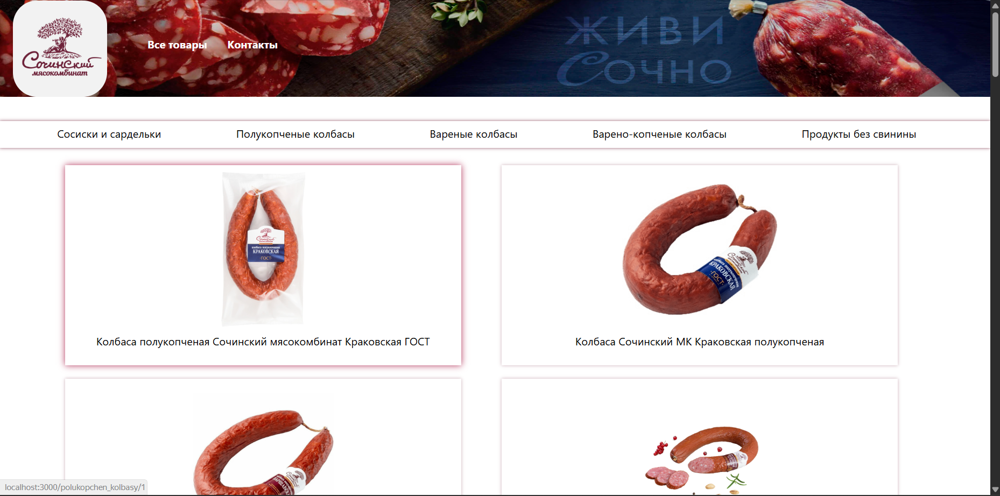
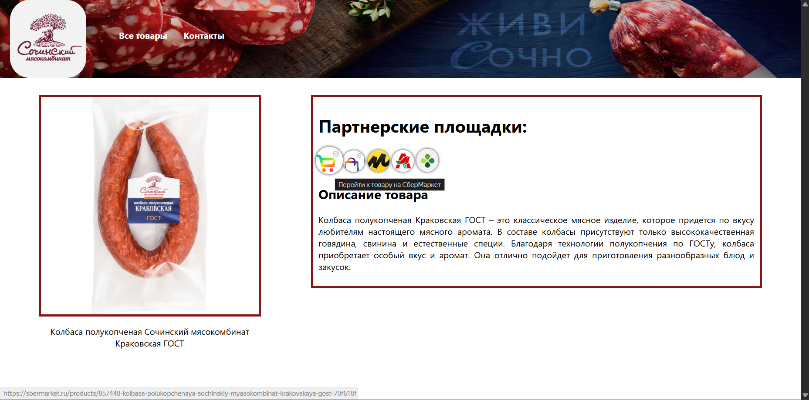

# Meat Products Navigator

Веб-приложение (SPA), разработанное на **React.js** с использованием **Firebase**, предназначенное для навигации по мясной продукции (сосиски, колбасы и другие изделия) и быстрого перехода к товарам на партнёрских онлайн-площадках.

Проект создавался как учебно-практический и ориентирован на демонстрацию навыков frontend-разработки и работы с backend-as-a-service.

Инициализирован с помощью Create React App.

---

## 🚀 Основной функционал

- Отображение списка мясной продукции
- Разделение товаров по категориям
- Страница отдельного продукта с кратким описанием
- Список партнёрских площадок для заказа выбранного товара
- Индикация доступности товара у партнёров:
  - при наведении отображается статус (Перейти к товару на... / *недоступен)
- Переход по ссылке напрямую на страницу товара у выбранного партнёра

---

## 🛠 Используемые технологии

- **React.js**
  - функциональные компоненты
  - хуки (useState, useEffect)
  - маршрутизация (React Router)
- **Firebase**
  - хранение данных о товарах и категориях
  - интеграция с frontend
- **HTML5 / CSS3**
- **JavaScript (ES6+)**

---

## 📌 Архитектура и логика

- SPA-приложение с клиентской маршрутизацией
- Данные о товарах, категориях и партнёрах загружаются из Firebase
- Компонентный подход:
  - список товаров
  - карточка товара
  - страница продукта
  - блок партнёрских площадок
- Реализована логика отображения статуса доступности товара без перехода на сайт партнёра

---

## 🎯 Цель проекта

- Закрепить навыки работы с React
- Получить практический опыт интеграции с Firebase
- Реализовать реальный пользовательский сценарий:
  **поиск товара → просмотр информации → переход к покупке**
- Использовать проект как часть портфолио для стажировки / junior-позиции

---

## 📷 Скриншоты





---

## 📦 Запуск проекта локально

```bash
git clone https://github.com/S7ikeCat/Website-Navigator.git
cd Website-Navigator
npm install
Создать `.env` на основе `.env.example` и вставить свои ключи Firebase
npm start
